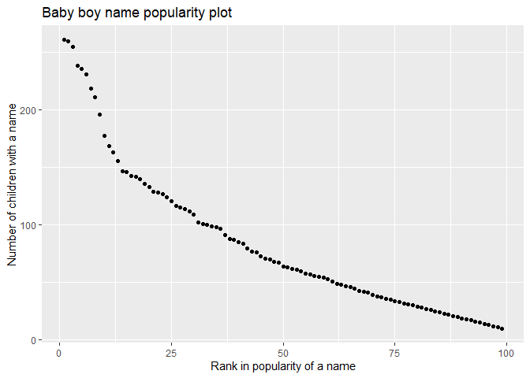

P8105 Homework 2 Solution
================
Xun Wang
9/25/2019

This file is the solution to P8105 Homework 2 from Xun Wang (xw2417).

## Problem 1

This problem uses the *Mr. Trash Wheel* dataset.

#### 1.1 Read and clean the Mr. Trash Wheel sheet.

The code chunk below reads and cleans the *Mr. Trash Wheel* sheet. It
omits non-data entrues and rows not including dumpster-specific data,
and rounds the number of sports balls to the nearest integer and
converts the result to an integer variable. Only the first 5 rows of the
cleaned data are printed.

``` r
mr_trash_wheel_data = 
  readxl::read_excel(
    "data/HealthyHarborWaterWheelTotals2018-7-28.xlsx",
    sheet = "Mr. Trash Wheel",
    range = "A2:N338"
    ) %>%
  janitor::clean_names() %>%
  drop_na(dumpster) %>% 
  mutate(
    date = str_sub(as.character(date), -2, -1),
    sports_balls = as.integer(sports_balls)) %>% 
  select(dumpster, year, month, day = date, everything()) %>% 
  pivot_longer(
    plastic_bottles:sports_balls,
    names_to = "trash_category",
    values_to = "number"
  ) %>% 
  mutate(number = as.numeric(number))

head(mr_trash_wheel_data, n = 5)
```

    ## # A tibble: 5 x 9
    ##   dumpster  year month day   weight_tons volume_cubic_ya~ homes_powered
    ##      <dbl> <dbl> <chr> <chr>       <dbl>            <dbl>         <dbl>
    ## 1        1  2014 May   16           4.31               18             0
    ## 2        1  2014 May   16           4.31               18             0
    ## 3        1  2014 May   16           4.31               18             0
    ## 4        1  2014 May   16           4.31               18             0
    ## 5        1  2014 May   16           4.31               18             0
    ## # ... with 2 more variables: trash_category <chr>, number <dbl>

#### 1.2 Read and clean precipitation data.

The code chunk below read and clean precipitation data for 2017 and
2018. It omits rows without precipitation data and adds a variable year.
Then, it combines precipitation datasets and convert month to a
character variable.

``` r
precip_data_2017 = 
  readxl::read_excel(
    "data/HealthyHarborWaterWheelTotals2018-7-28.xlsx",
    sheet = "2017 Precipitation",
    range = "A2:B14"
    ) %>%
  mutate(year = "2017") %>% 
  janitor::clean_names() 

precip_data_2018 = 
  readxl::read_excel(
    "data/HealthyHarborWaterWheelTotals2018-7-28.xlsx",
    sheet = "2018 Precipitation",
    range = "A2:B14"
    ) %>%
  mutate(year = "2018") %>% 
  janitor::clean_names() %>% 
  drop_na(total)

precip_data = 
  bind_rows(precip_data_2017, precip_data_2018) %>%
  mutate(month = month.name[month]) %>% 
  select(year, month, total_inch = total)

precip_data
```

    ## # A tibble: 19 x 3
    ##    year  month     total_inch
    ##    <chr> <chr>          <dbl>
    ##  1 2017  January         2.34
    ##  2 2017  February        1.46
    ##  3 2017  March           3.57
    ##  4 2017  April           3.99
    ##  5 2017  May             5.64
    ##  6 2017  June            1.4 
    ##  7 2017  July            7.09
    ##  8 2017  August          4.44
    ##  9 2017  September       1.95
    ## 10 2017  October         0   
    ## 11 2017  November        0.11
    ## 12 2017  December        0.94
    ## 13 2018  January         0.96
    ## 14 2018  February        5.3 
    ## 15 2018  March           2.18
    ## 16 2018  April           3.2 
    ## 17 2018  May             9.27
    ## 18 2018  June            0.2 
    ## 19 2018  July            2.39

#### 1.3 Comments.

**Comments on cleaning data:** Both the *Mr. Trash Wheel* and the
*precipitation* datasets are cleaned by `janitor::clean_names`. The
*Mr. Trash Wheel* data is also tidied by `pivot_longer` (I combined all
the different trash types into one column named *trash\_category* and
put the values to the column *number*). Since there are column *year*
and *month* already, I simplied the *date* column to *day* column only
leaving the “day” information in this column.

**Comments on the data:** The *Mr. Trash Wheel* dataset has 1995 rows
and 9 columns. There are 285 observations between 5/16/2014 and
7/18/2018 for 7 categories of trash. The total weight and volume of
trash, and the home number the trash powered in each observation are
also recorded. The **key** variable is the *dumpster* number.

The *precipitation* dataset has 19 rows and 3 columns. There are 19
observations between January 2017 and July 2018. For each observation,
the total inches of the precipitation was recored. The **key** variables
are the *year* and *month*.

For available data, the **total** precipitation in 2018 was **23.5
inches**. The **median** number of sports balls in a dumpster in 2017
was **8**.

## Problem 2

This problem uses the *FiveThirtyEight* dataset.

#### 2.1 Read and clean the datasets.

The code chunk below reads and cleans the data in pols-month.csv. Note
that there are some “2”s in the *prez\_gop* data, and I consider those
observations as “1”s. Only the first 5 rows of the cleaned data are
printed.

``` r
party = c("dem", "gop", "gop")

pols_data = 
  read.csv(file = "./data/fivethirtyeight_datasets/pols-month.csv") %>% 
  janitor::clean_names() %>% 
  separate(mon, into = c("year", "month", "day")) %>% 
  mutate(month = month.name[as.integer(month)],
         president = party[prez_gop + 1]) %>%
  select(year, month, president, everything(), -day, -prez_dem, -prez_gop)

head(pols_data, n = 5)
```

    ##   year    month president gov_gop sen_gop rep_gop gov_dem sen_dem rep_dem
    ## 1 1947  January       dem      23      51     253      23      45     198
    ## 2 1947 February       dem      23      51     253      23      45     198
    ## 3 1947    March       dem      23      51     253      23      45     198
    ## 4 1947    April       dem      23      51     253      23      45     198
    ## 5 1947      May       dem      23      51     253      23      45     198

The code chunk below reads and cleans the data in snp.csv. To make the
variable name more clear, variable name *close* is repalced by
*snp\_index*. Only the first 5 rows of the cleaned data are printed.

``` r
snp_data = 
  read.csv(file = "./data/fivethirtyeight_datasets/snp.csv") %>% 
  janitor::clean_names() %>% 
  separate(date, into = c("month", "day", "year")) %>% 
  mutate(month = month.name[as.integer(month)]) %>% 
  select(year, month, snp_index = close)

head(snp_data, n = 5)
```

    ##   year month snp_index
    ## 1 2015  July   2079.65
    ## 2 2015  June   2063.11
    ## 3 2015   May   2107.39
    ## 4 2015 April   2085.51
    ## 5 2015 March   2067.89

The code chunk below reads and cleans the data in unemployment.csv. To
make the variable name more clear, variable name *percentage* is
repalced by *unemploy\_percentage*. Only the first 5 rows of the cleaned
data are printed.

``` r
unemploy_data = 
  read.csv(file = "./data/fivethirtyeight_datasets/unemployment.csv") %>% 
  pivot_longer(
    Jan:Dec,
    names_to = "month",
    values_to = "percentage"
  ) %>% 
  mutate(month = month.name[match(pull(., month), month.abb)],
         Year = as.character(Year)) %>% 
  select(year = Year, month, unemploy_percentage = percentage)

head(unemploy_data, n = 5)
```

    ## # A tibble: 5 x 3
    ##   year  month    unemploy_percentage
    ##   <chr> <chr>                  <dbl>
    ## 1 1948  January                  3.4
    ## 2 1948  February                 3.8
    ## 3 1948  March                    4  
    ## 4 1948  April                    3.9
    ## 5 1948  May                      3.5

#### 2.2 Join the datasets.

The code chunk below merges `snp` into `pols` by `left_join`, and then
merges `unemployment` into the result by `left_join` again. Because the
`pols` data has the longest time span, so most information would be kept
if the other 2 datasets are **left joined** into the `pols` dataset.
Only the first 5 rows of the cleaned data are printed.

``` r
pols_snp_unemploy = 
  left_join(pols_data, snp_data, by = c("year", "month")) %>% 
  left_join(unemploy_data, by = c("year", "month")) %>% 
  drop_na(snp_index, unemploy_percentage)

head(pols_snp_unemploy, n = 5)
```

    ##    year    month president gov_gop sen_gop rep_gop gov_dem sen_dem rep_dem
    ## 37 1950  January       dem      18      44     177      29      57     269
    ## 38 1950 February       dem      18      44     177      29      57     269
    ## 39 1950    March       dem      18      44     177      29      57     269
    ## 40 1950    April       dem      18      44     177      29      57     269
    ## 41 1950      May       dem      18      44     177      29      57     269
    ##    snp_index unemploy_percentage
    ## 37     17.05                 6.5
    ## 38     17.22                 6.4
    ## 39     17.29                 6.3
    ## 40     17.96                 5.8
    ## 41     18.78                 5.5

#### 2.3 Comments.

The `pols_data` has 822 rows and 9 columns, indicating in a specific
year and month, whether the president was republican (`gop`) or
democratic (`dem`), and the numbers of republican / democratic governors
(`gov_gop` / `gov_dem`), senators (`sen_gop` / `sen_dem`) and
representatives (`rep_gop` / `rep_dem`).

The `snp_data` has 787 rows and 3 columns, indicating the closing values
of the S\&P stock index at the beginning of a specific year and month.

The `unemploy_data` has 816 rows and 3 columns, indicating the
percentage of unemployment in a specific year and month.

Since the `pols_data` has the most information, I did `left_join` to
merge the `snp_data` and the `unemploy_data` into the `pols_data` one by
one. Then any row with a missing value was removed. The resulting
dataset `pols_snp_unemploy` has **786 rows** and **11 columns**, ranging
from **January 1950** to **June 2015**. The **key** varibales are *year*
and *month*. And the resulting dataset gives us whether the president
was republican or democratic, the numbers of republican / democratic
governors / senators / representatives, the closing values of the S\&P
stock index, and the percentage of unemployment in a specific year and
month.

## Problem 3

This problem uses the *NYC Open* data on the popularity of baby names.

#### 3.1 Read and clean the dataset.

The code chunk below reads and cleans the *Popular\_Baby\_Names.csv*. To
make the format clean, all the variable names are cleaned by
`janitor::clean_names` and all the string variables are converted to
lower cases by `str_to_lower`. Some of the *ethnicity* values are
written in different ways (e.g. “asian and pacific islander” vs "asian
and paci), so they need to be converted to the same way by `replace`.
Some rows seem duplicated, and these duplicated rows are removed by
`distinct`. Only the first 5 rows of the cleaned data are printed.

``` r
baby_name_data = 
  read.csv(file = "./data/Popular_Baby_Names.csv") %>%
  janitor::clean_names() %>% 
  mutate(
    gender = str_to_lower(gender),
    ethnicity = str_to_lower(ethnicity),
    child_s_first_name = str_to_lower(child_s_first_name),
    ethnicity = replace(ethnicity, ethnicity == "asian and paci", "asian and pacific islander"),
    ethnicity = replace(ethnicity, ethnicity == "black non hisp", "black non hispanic"),
    ethnicity = replace(ethnicity, ethnicity == "white non hisp", "white non hispanic")
    ) %>% 
  distinct()

head(baby_name_data, n = 5)
```

    ##   year_of_birth gender                  ethnicity child_s_first_name count
    ## 1          2016 female asian and pacific islander             olivia   172
    ## 2          2016 female asian and pacific islander              chloe   112
    ## 3          2016 female asian and pacific islander             sophia   104
    ## 4          2016 female asian and pacific islander              emily    99
    ## 5          2016 female asian and pacific islander               emma    99
    ##   rank
    ## 1    1
    ## 2    2
    ## 3    3
    ## 4    4
    ## 5    4

#### 3.2 Reader-friendly tables creation.

The code chunk below produces a well-structured, reader-friendly table
showing the rank in popularity of the name “Olivia” as a female baby
name over time with rows for ethnicities and columns for year.

``` r
olivia_data = 
  filter(baby_name_data, gender == "female", child_s_first_name == "olivia") %>% 
  select(year_of_birth, ethnicity, rank) %>% 
  pivot_wider(
    names_from = "year_of_birth", 
    values_from = "rank")

knitr::kable(olivia_data, format = "html", caption = "Table 1: Popularity rank of “Olivia” as a female baby name over time")
```

<table>

<caption>

Table 1: Popularity rank of “Olivia” as a female baby name over time

</caption>

<thead>

<tr>

<th style="text-align:left;">

ethnicity

</th>

<th style="text-align:right;">

2016

</th>

<th style="text-align:right;">

2015

</th>

<th style="text-align:right;">

2014

</th>

<th style="text-align:right;">

2013

</th>

<th style="text-align:right;">

2012

</th>

<th style="text-align:right;">

2011

</th>

</tr>

</thead>

<tbody>

<tr>

<td style="text-align:left;">

asian and pacific islander

</td>

<td style="text-align:right;">

1

</td>

<td style="text-align:right;">

1

</td>

<td style="text-align:right;">

1

</td>

<td style="text-align:right;">

3

</td>

<td style="text-align:right;">

3

</td>

<td style="text-align:right;">

4

</td>

</tr>

<tr>

<td style="text-align:left;">

black non hispanic

</td>

<td style="text-align:right;">

8

</td>

<td style="text-align:right;">

4

</td>

<td style="text-align:right;">

8

</td>

<td style="text-align:right;">

6

</td>

<td style="text-align:right;">

8

</td>

<td style="text-align:right;">

10

</td>

</tr>

<tr>

<td style="text-align:left;">

hispanic

</td>

<td style="text-align:right;">

13

</td>

<td style="text-align:right;">

16

</td>

<td style="text-align:right;">

16

</td>

<td style="text-align:right;">

22

</td>

<td style="text-align:right;">

22

</td>

<td style="text-align:right;">

18

</td>

</tr>

<tr>

<td style="text-align:left;">

white non hispanic

</td>

<td style="text-align:right;">

1

</td>

<td style="text-align:right;">

1

</td>

<td style="text-align:right;">

1

</td>

<td style="text-align:right;">

1

</td>

<td style="text-align:right;">

4

</td>

<td style="text-align:right;">

2

</td>

</tr>

</tbody>

</table>

The code chunk below produces a table showing the most popular name
among male children over time.

``` r
popular_male_name = 
  filter(baby_name_data, gender == "male", rank == "1") %>% 
  select(year_of_birth, ethnicity, child_s_first_name) %>% 
  pivot_wider(
    names_from = "year_of_birth", 
    values_from = "child_s_first_name")

knitr::kable(popular_male_name, format = "html", caption = "Table 2: Most popular male children name over time")
```

<table>

<caption>

Table 2: Most popular male children name over time

</caption>

<thead>

<tr>

<th style="text-align:left;">

ethnicity

</th>

<th style="text-align:left;">

2016

</th>

<th style="text-align:left;">

2015

</th>

<th style="text-align:left;">

2014

</th>

<th style="text-align:left;">

2013

</th>

<th style="text-align:left;">

2012

</th>

<th style="text-align:left;">

2011

</th>

</tr>

</thead>

<tbody>

<tr>

<td style="text-align:left;">

asian and pacific islander

</td>

<td style="text-align:left;">

ethan

</td>

<td style="text-align:left;">

jayden

</td>

<td style="text-align:left;">

jayden

</td>

<td style="text-align:left;">

jayden

</td>

<td style="text-align:left;">

ryan

</td>

<td style="text-align:left;">

ethan

</td>

</tr>

<tr>

<td style="text-align:left;">

black non hispanic

</td>

<td style="text-align:left;">

noah

</td>

<td style="text-align:left;">

noah

</td>

<td style="text-align:left;">

ethan

</td>

<td style="text-align:left;">

ethan

</td>

<td style="text-align:left;">

jayden

</td>

<td style="text-align:left;">

jayden

</td>

</tr>

<tr>

<td style="text-align:left;">

hispanic

</td>

<td style="text-align:left;">

liam

</td>

<td style="text-align:left;">

liam

</td>

<td style="text-align:left;">

liam

</td>

<td style="text-align:left;">

jayden

</td>

<td style="text-align:left;">

jayden

</td>

<td style="text-align:left;">

jayden

</td>

</tr>

<tr>

<td style="text-align:left;">

white non hispanic

</td>

<td style="text-align:left;">

joseph

</td>

<td style="text-align:left;">

david

</td>

<td style="text-align:left;">

joseph

</td>

<td style="text-align:left;">

david

</td>

<td style="text-align:left;">

joseph

</td>

<td style="text-align:left;">

michael

</td>

</tr>

</tbody>

</table>

#### 3.3 Scatter plot creation.

The code chunk below produces a scatter plot showing the number of
children with a name (y) against the rank in popularity of that name (x)
for male, white non-hispanic children born in 2016.

``` r
scatter_plot_data = 
  filter(
    baby_name_data, 
    year_of_birth == "2016", 
    gender == "male", 
    ethnicity == "white non hispanic") %>% 
  select(rank, count)

ggplot(scatter_plot_data, aes(x = rank, y = count)) + 
  geom_point() +
  labs(
    title = "Baby boy name popularity plot",
    x = "Rank in popularity of a name",
    y = "Number of children with a name"
  )
```

<!-- -->
